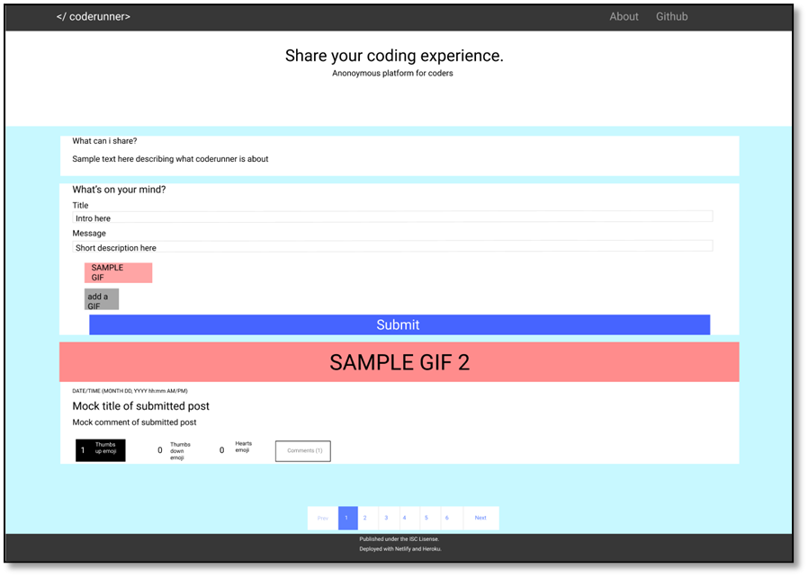

# Design Notes

## Design Goals

### Client

1. Find websites similar to our project for inspiration.
2. Make a design *(e.g. using figma, wireframe, etc.)*

### Server

1. Decide on data strucure *(what will the JSON look like?)*
2. Decide on API routes and what each one will do *(CRUD, REST)*

## 1. Client

### 1.1. Reference Websites

* [Everyday Sexism Project 🔗](https://everydaysexism.com/)
* [Twitter 🔗](https://twitter.com/)
* [Reddit 🔗](https://www.reddit.com/)
* [The Guardian 🔗](https://www.theguardian.com/)

### 1.2. Design



## Server

### 2.1. Data Structure (JSON)

```json
{ // for each journal post
    "id": 0,
    "title": "title",
    "message": "message",
    "giphy": "giphy_url",
    "comments": [
        {
            "id": 0,
            "comment": "message",
            "timestamp": 0
        }
    ],
    "reactions": {
        // each array contains identifiers for the users who have reacted
        // this allows the client to track whether a user has reacted using cookies
        "thumbs_up": [],
        "thumbs_down": [],
        "heart": []
    },
    "tags": [
        "tag1", "tag2", "tag3"
    ],
    "timestamp": 0
}
```

### 2.2. API Routes

| Route | Action |
| - | - |
| `GET /posts` | Return a JSON object of all post data |
| `GET /posts/:pid` | Return a JSON object with data for a specific post |
| `POST /posts` | Create a new post data entry |
| `PATCH /posts/:pid/emoji` | Add or remove an emoji reaction from a post |
| `POST /posts/:pid/comments` | Create a new comment on a post |

#### `POST /posts` request body

```json
{
    "title": "title",
    "message": "message",
    "giphy": "giphy_url",
    "tags": [
        "tag1", "tag2", "tag3"
    ]
}
```

#### `PATCH /posts/:pid/emoji` request body

```json
{
    "emoji": "thumbs_up",
    "uid": "325346346" // cookie so that users can add/remove reactions
}
```
#### `POST /posts/:pid/comments` request body

```json
{
    "comment": "message"
}
```
